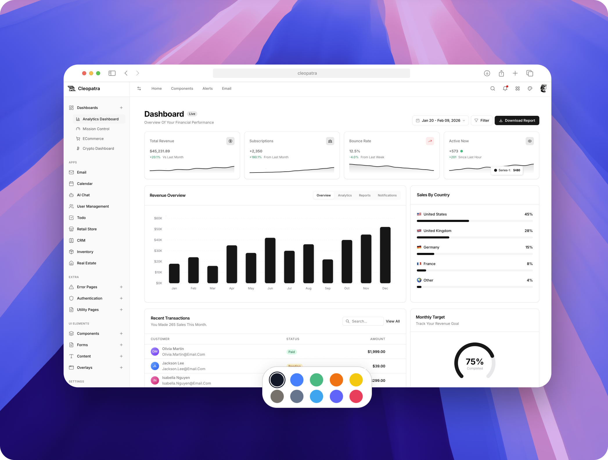
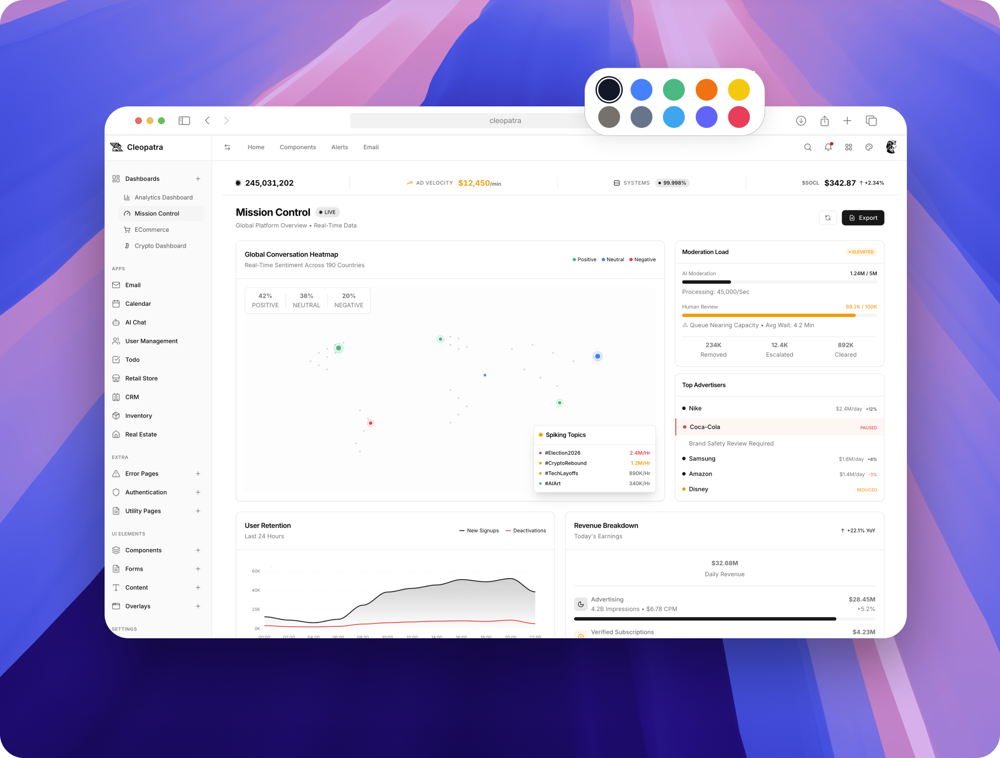
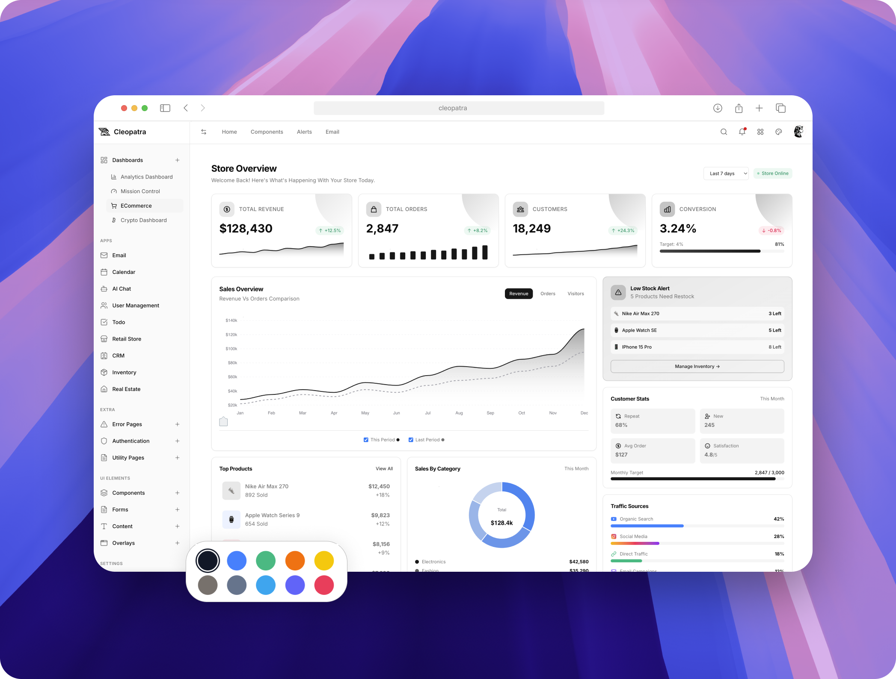

<div align="center">
  
  <h1>Cleopatra</h1>
  <p><strong>Modern Admin Dashboard Template</strong></p>
  
  [](https://lbesson.mit-license.org/)
  [](https://vitejs.dev/)
  [](https://tailwindcss.com/)
  
  <p>A beautifully designed, production-ready admin dashboard built with <strong>Tailwind CSS v4</strong> and <strong>Vite</strong>.</p>
  
  [Live Demo](https://moesaid.github.io/cleopatra/)
</div>

---

## Preview

<div align="center">
  
</div>

### 4 Dashboard Templates

| Analytics | E-commerce |
|-----------|------------|
|  |  |

| Crypto | Mission Control |
|--------|-----------------|
|  |  |

---

## Features

- **4 Dashboard Templates** - Analytics, E-commerce, Crypto, Mission Control
- **2 Themes** - Light & Dark mode
- **47+ Pages** - Authentication, Apps, Components, Forms, and more
- **15+ Components** - Buttons, Cards, Tables, Charts, Modals, etc.
- **SPA Navigation** - Smooth transitions without page reloads
- **Responsive Design** - Works on all devices
- **Modern Stack** - Vite, Tailwind CSS v4, Handlebars

---

## Why Pure JavaScript?

Cleopatra is built with vanilla JavaScript intentionally:

- **Zero Framework Lock-in** - Use it with any backend (Laravel, Django, Rails, Node, or static)
- **Faster Load Times** - No framework runtime overhead
- **Easy to Understand** - Simple, readable code without framework abstractions
- **Future Proof** - Vanilla JS never goes out of style
- **Lightweight** - Smaller bundle size means faster page loads
- **Full Control** - No hidden magic, you own every line of code

This makes Cleopatra perfect for developers who want a clean starting point without the complexity of React, Vue, or Angular.

---

## Quick Start

```bash
# Clone the repository
git clone https://github.com/moesaid/cleopatra.git

# Navigate to directory
cd cleopatra

# Install dependencies
npm install

# Start development server
npm run dev
```

Open [http://localhost:8081](http://localhost:8081)

---

## Project Structure

```
src/
├── components/
│   ├── layout/      # App shell, header, sidebar
│   ├── ui/          # Buttons, cards, alerts, modals
│   ├── widgets/     # Dashboard widgets, charts, stats
│   └── charts/      # ApexCharts & Chart.js components
├── pages/           # Route files
├── styles/          # Global styles & Tailwind config
└── js/              # JavaScript modules
```

---

## Customization

### Theme Colors

Choose from 10 accent colors:


|---|---|---|---|---|
| Black (default) | Blue | Green | Orange | Yellow |
| Olive | Slate | Cyan | Purple | Rose |

### Theme Modes

- **Light Mode** - Clean white interface
- **Dark Mode** - Easy on the eyes

---

## Tech Stack

| Tool | Purpose |
|------|---------|
| **Vite** | Build tool & dev server |
| **Tailwind CSS v4** | Utility-first styling |
| **Handlebars** | Template partials |
| **ApexCharts** | Interactive charts |
| **Chart.js** | Additional chart types |

---

## License

MIT © [Mohamed Said](https://moesaid.com)
